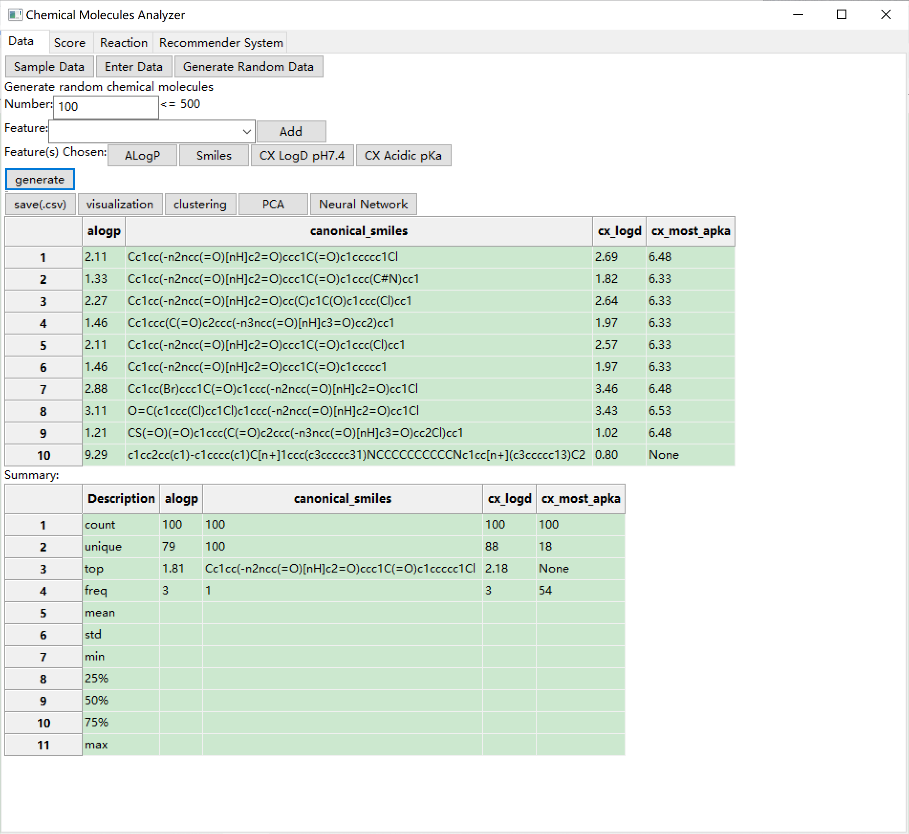
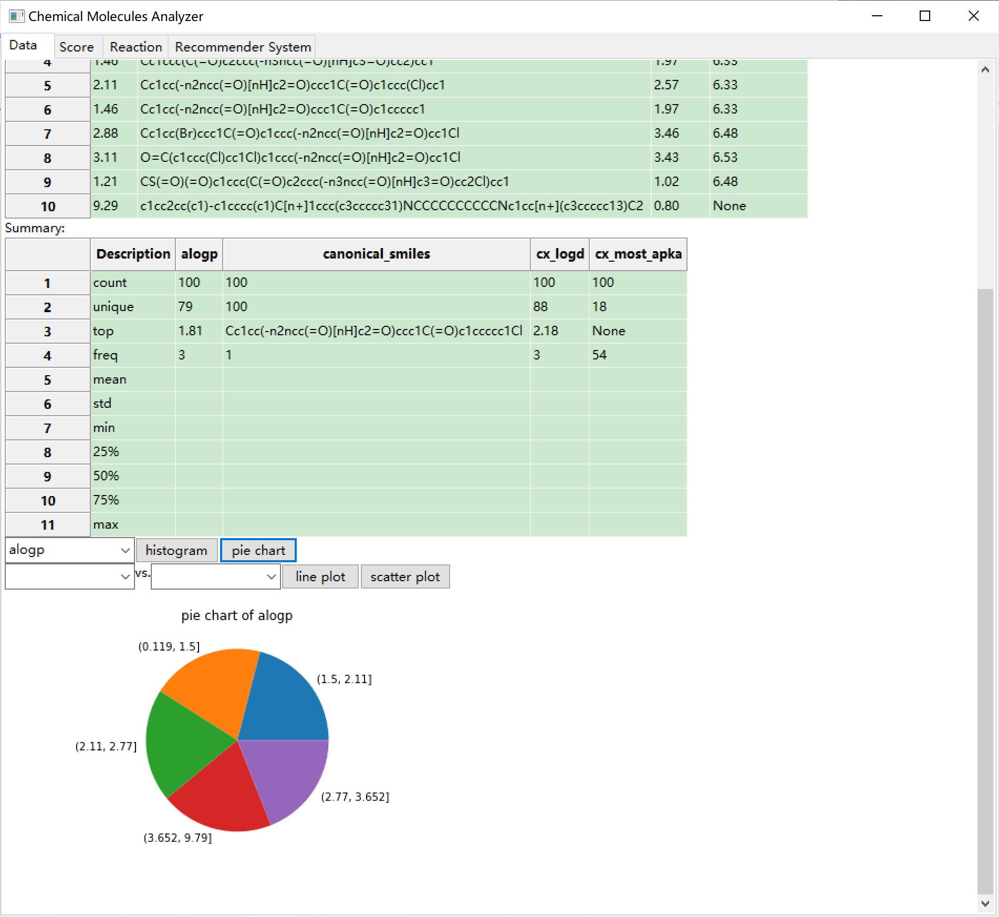
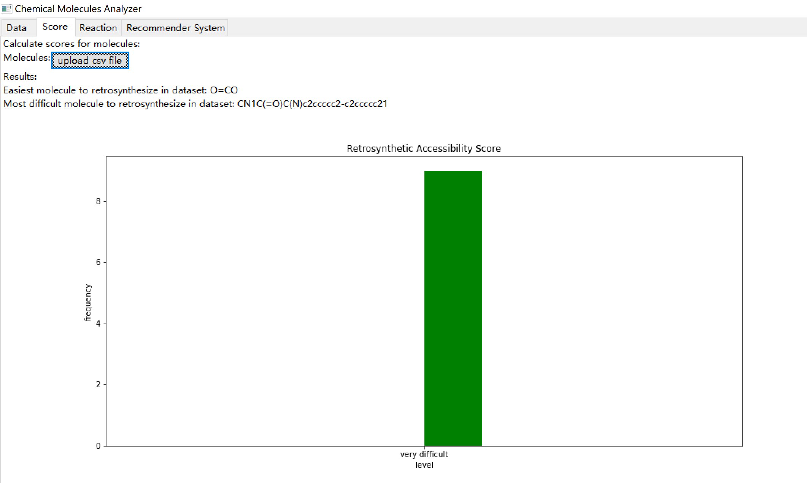
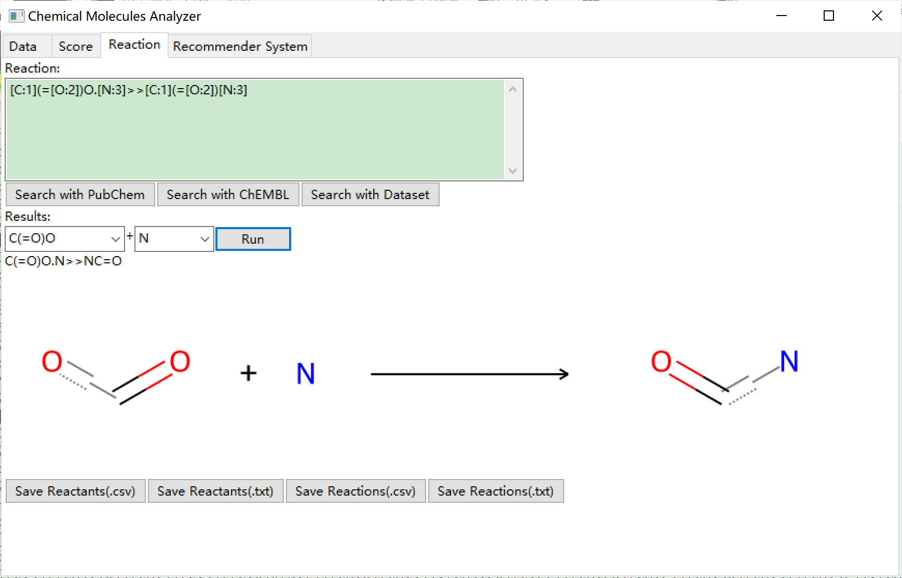
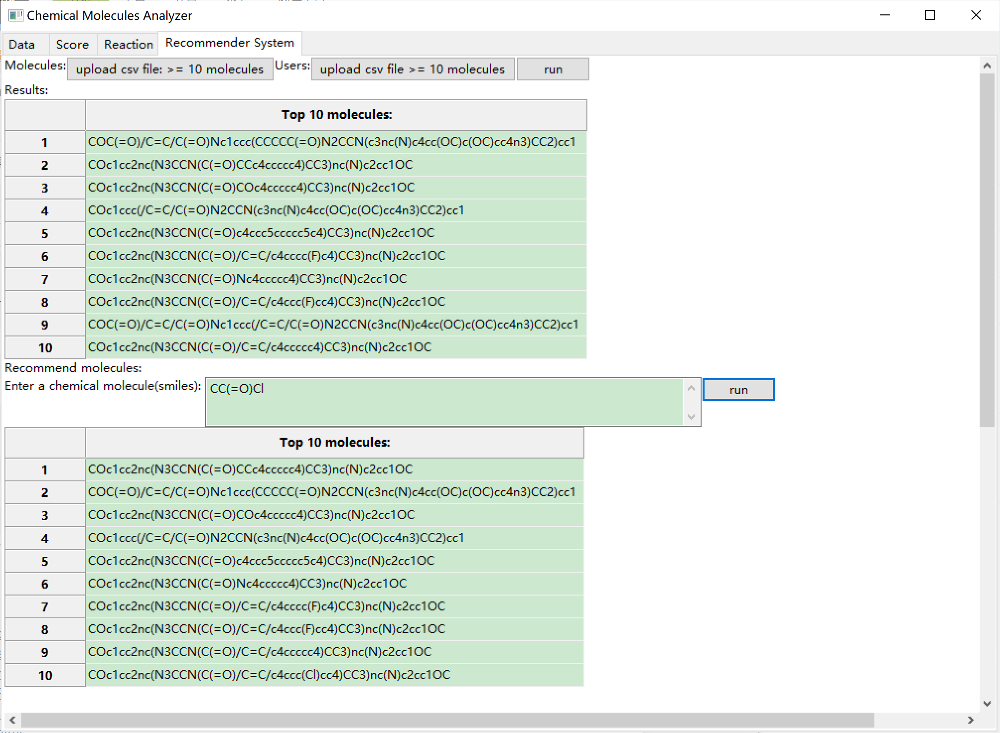

# chemical-molecules-analyzer
This is a GUI built with wxPython for performing analysis tasks related to chemical molecules. 
This user-friendly interface enables users to generate datasets and obtain results by simply clicking the buttons or entering values.
# Installation
- Python 3.8 https://www.python.org/downloads/release/python-380/
- wxPython https://www.wxpython.org/
- ChemML https://github.com/hachmannlab/chemml
- ChEMBL webresource client https://github.com/chembl/chembl_webresource_client
- PubChempy https://github.com/mcs07/PubChemPy
- RAscore https://github.com/reymond-group/RAscore
- NP score https://github.com/rdkit/rdkit/tree/master/Contrib/NP_Score
- SA score https://github.com/rdkit/rdkit/tree/master/Contrib/SA_Score
- QED score https://github.com/UAMCAntwerpen/qed
- SYBA score https://github.com/lich-uct/syba
- RDKit https://github.com/rdkit/rdkit
- pandas https://github.com/pandas-dev/pandas
- NumPy https://github.com/numpy/numpy
- scikit-learn https://github.com/scikit-learn/scikit-learn
- matplotlib https://github.com/matplotlib/matplotlib

# Data 
- Generate datasets with different features of chemical molecules
- Visualization of random dataset generated: pie chart, histogram, line plots and scatter plots
- Clustering: From inertia value vs. number of clusters, users could obtain the optimal number of groups could be formed from the random datasets generated
- PCA: From pie chart of explained variance ratio, users could see the percent of representative features from the random dataset
- Neural Network: 
   - Select certain feature from the random dataset as target feature 
   - Select different parameters to build a neural network, and classify the chemical molecules with
the attributes of the target feature 
   - The user could observe accuracy of moldel prediction and different types of mean and squared errors

Example:

# Score 
- Import a datasets with SMILES of chemical molecules
- The scores are converted to difficulty levels from the easiest level to the most difficult level
- The SMILES of chemical molecules with the easiest level and the most difficult level based on the scores will be displayed
- The histograms that have the frequency distribution of the chemical molecules with difficulty levels will be displayed

Five types of scores:
- Retrosynthetic Accessibility Score
- Natural Product-likeness Score
- Synthetic Accessibility Score 
- Quantitative Estimation of Drug-likeness Score
- SYnthetic Bayesian Accessibility Score
Example:

# Reaction
- Enter a chemical reaction
- Search the chemical molecules that have high structural similarities with the reactants using PubChem, ChEMBL or the dataset imported
- Run chemical reactions with the resulting chemical molecules
- The corresponding reaction image will be displayed

Example:

# Recommender System (collaborative filtering method)
- Import two datasets with SMILES of chemical molecules. One is "Users", the other one is "Molecules";
- The chemical molecules(users) in "Users" dataset will give ratings to the chemical molecules(items) in "Molecules" dataset with the average value of features between users and items. (e.g., the average value of molecular weights between the users and items ) 
- The top 10 molecules rated by the user that has highest number of similar ratings with other users will be displayed
- Enter a chemical molecules in SMILES format as "user", and the top 10 items rated by the user that has highest number of similar ratings with this user will be displayed

Example:

# Citation
Haghighatlari, M., Vishwakarma, G., Altarawy, D., Subramanian, R., Kota, B., Sonpal, A., Setlur, S., & Hachmann, J. (2019). ChemML: A Machine Learning and Informatics Program Package for the Analysis, Mining, and Modeling of Chemical and Materials Data. ChemRxiv, 8323271.  https://doi.org/10.26434/chemrxiv.8323271.v1

Thakkar, A.; Chadimová, V.; Bjerrum, E. J.; Engkvist, O.; Reymond, J.-L. Retrosynthetic Accessibility Score (RAscore) – Rapid Machine Learned Synthesizability Classification from AI Driven Retrosynthetic Planning. Chem. Sci. 2021. https://doi.org/10.1039/d0sc05401a

Estimation of Synthetic Accessibility Score of Drug-like Molecules based on Molecular Complexity and Fragment Contributions
Peter Ertl and Ansgar Schuffenhauer
Journal of Cheminformatics 1:8 (2009)
http://www.jcheminf.com/content/1/1/8

Natural Product-likeness Score and Its Application for Prioritization of Compound Libraries 
Peter Ertl, Silvio Roggo, and Ansgar Schuffenhauer
Journal of Chemical Information and Modeling, 48, 68-74 (2008)
http://pubs.acs.org/doi/abs/10.1021/ci700286x

Voršilák, M., Kolář, M., Čmelo, I. et al. SYBA: Bayesian estimation of synthetic accessibility of organic compounds. J Cheminform 12, 35 (2020). https://doi.org/10.1186/s13321-020-00439-2

Bickerton, G., Paolini, G., Besnard, J. et al. Quantifying the chemical beauty of drugs. Nature Chem 4, 90–98 (2012). https://doi.org/10.1038/nchem.1243
